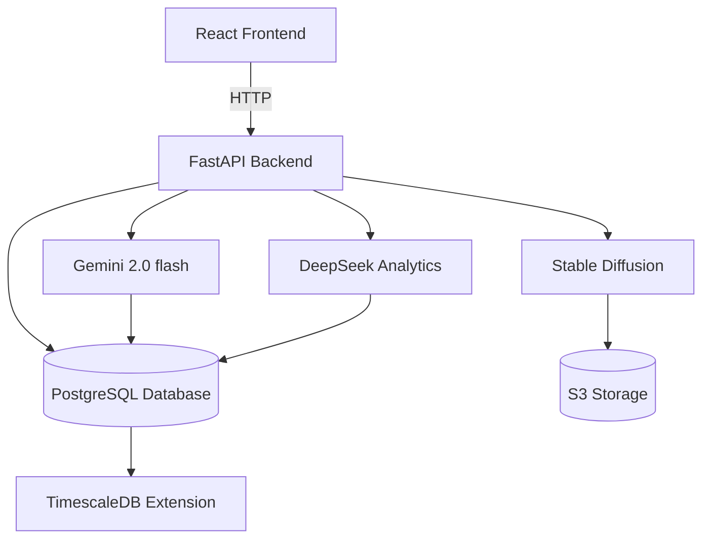

# **Grab MEX AI Assistant**  
### *The Complete AI-Powered Merchant Growth Platform*  

---

## **Table of Contents**
1. [System Overview](#system-overview)  
2. [Key Features](#key-features)  
3. [Technology Architecture](#technology-architecture)  
4. [Installation Guide](#installation-guide)  
5. [AI Services Integration](#ai-services-integration)  
6. [Customization](#customization)  
7. [Deployment](#deployment)  
  8. [Security Configuration](#security-configuration)  
9. [API Documentation](#api-documentation)  
10. [License & Contact](#license--contact)  

---

<a name="system-overview"></a>
## **1. System Overview**  
The **Grab MEX AI Assistant** is an end-to-end merchant support platform combining:  

- **Conversational AI** (Gemini 2.0 Flash + RAG Pipeline)  
- **Visual Content Generation** (Stable Diffusion XL)
- **Advanced Analytics** (DeepSeek + TimescaleDB)
- **Real-time Monitoring** (FastAPI + WebSocket)

### **Technical Stack**
- **Frontend**: React 18+, Vite, TailwindCSS, Javascripts
- **Backend**: Python 3.10+, FastAPI, 
- **AI Models**: Gemini 2.0 Flash

### **Core Benefits**  

The **Grab MEX AI Assistant** offers a comprehensive suite of benefits tailored to empower merchants and streamline operations:  

✔ **24/7 Multilingual Business Advisory**  
  - Supports English, Bahasa, Thai, and Vietnamese for seamless communication across regions.  
  - RAG-Pipeline enhanced responses for accurate local context
  - Real-time translation capabilities

✔ **Predictive Financial Insights**  
  - Leverage advanced analytics to forecast revenue and optimize financial planning.  
  - Anomaly detection and early warning system

✔ **Real-Time Inventory and Sales Monitoring**  
  - Stay updated with live data on stock levels and sales performance.  
  - Smart reorder predictions
  - Automated stockout alert

✔ **Customizable AI Models for Regional Business Needs**  
  - Fine-tune AI models to align with local market trends and merchant requirements.  
  - Region-specific pricing optimization

✔ **Scalable Architecture for Growing Businesses**  
  - Designed to handle increasing workloads as your business expands.  
  - Microservices-ready architecture
  - Horizontal scaling capabilities

✔ **Enhanced Data Security with On-Premise Options**  
  - Protect sensitive business data with secure, on-premise deployment options.  
  - End-to-end encryption
  - GDPR and PDPA compliant

✔ **User-Friendly Interface for Non-Technical Users**  
  - Intuitive design ensures accessibility for all users, regardless of technical expertise.  
  - Context-aware help system
  - Step-by-step guided workflows
  - Unique Customer Record
---

<a name="key-features"></a>
## **2. Key Features**  

### **🛠️ Merchant Toolkit**  
| Feature | Description | AI Models Used |  
|---------|-------------|----------------|  
| **Smart Chat** | Natural language Q&A about sales, inventory, etc. | Gemini 2.0 Flash |  
| **Smart Inventory System** | 30/60/90 day predictions with confidence intervals | Gemini 2.0 Flash |  
| **Menu Optimizer** | Identify best-performing items and combos | Gemini 2.0 Flash |  
| **Marketing Assistant** | Generate promotional content and campaign ideas | Gemini 2.0 Flash |  
| **Competitor Analysis** | Track and analyze nearby business performance | Gemini 2.0 Flash |  
| **Financial Forecaster** | Revenue predictions  | Gemini 2.0 Flash |  
| **Customer Insights** | Analyze feedback and identify improvement opportunities | Gemini 2.0 Flash | 
| **Ads Boosting** | AI-powered ad optimization with automated budget allocation and targeted audience segmentation | Gemini 2.0 Flash |
| **Campaign Performance** | Real-time analytics and A/B testing for promotional content | Gemini 2.0 Flash |
| **GrabAds Integration** | Direct integration with Grab's advertising platform for seamless campaign management | Gemini 2.0 Flash |  

### **⚠️ Alert System**  
- Real-time notifications for:  
  - AI Anomaly Detection  
  - customer message

- Customizable alert thresholds and notification channels:
  - Push notifications
  - In-app alerts

- Alert prioritization framework:
  - Critical (immediate action required)
  - Warning (attention needed)
  - Informational (for awareness)

---

<a name="technology-architecture"></a>
## **3. Technology Architecture**  



**Component Details:**  

| Layer | Technology | Purpose |  
|-------|------------|---------|  
| **UI** | React.js + Tailwind | Dashboard and chat interface |  
| **API** | Supabase | Gemini 2.0 Flash | 
| **AI** | See below | - |  

**AI Model Matrix:**  

| Model | Version | Deployment | Hardware Requirements |  
|-------|---------|------------|-----------------------|  
| Gemini | 2.0 Flash | GCP API | None |

**System Requirements:**

| Component | Minimum | Recommended |
|-----------|---------|-------------|
| CPU | 4 cores | 8+ cores |
| RAM | 16GB | 32GB+ |
| GPU | NVIDIA with 8GB VRAM | NVIDIA RTX 3080+ |
| Storage | 100GB SSD | 500GB NVMe SSD |
| Network | 100Mbps | 1Gbps |


- **Vector Store (FAISS)**
  - Document embeddings
  - Semantic search
  - RAG-Pipeline context storage

**API Endpoints:**

| Endpoint | Method | Description |
|----------|---------|-------------|
|             POST                 |
|----------|---------|-------------|
| `/api/chat` | POST | Chat completion with RAG |
| `/api/sd` | POST | Image generation |
| `/api/inventory` | GET/POST | Inventory management |
| `/api/customer-service` | GET/POST | Customer Service API |
| `/api/get_all_messages` | GET/POST | Messages API |
|----------|---------|-------------|
|             GET                  |
|----------|---------|-------------|
| `/api/analytics` | GET | Business metrics |

---

<a name="installation-guide"></a>
## **4. Installation Guide**  

### **Prerequisites**  
- Node.js v18+  
- Vite
- pip
- Python 3.10+  

### **Setup Process**  

**1. Clone Repository**  
```bash
git clone https://github.com/kimhongzhang323/UMH25.git
cd UMH25
```

**2. Configure Environment**  
```bash
# Frontend
cp frontend/.env.example frontend/.env

# Backend
cp backend/.env.example backend/.env
```

**Sample .env Configuration:**  
```ini
# Frontend
VITE_API_BASE=http://localhost:8000
VITE_SUPABASE_URL=your_supabase_url
VITE_SUPABASE_KEY=your_supabase_key

# Backend
API_KEY=your_genai_api
```

**3. Install Dependencies**  
```bash
# Frontend
cd frontend && npm install

# Backend
cd backend && pip install -r requirements.txt
```

**4. Setup AI Models**
```bash
# Download and configure models (if running locally)
cd backend

# run AI model
!! DONT FORGET TO RUN !!
python rag_pipeline.py 

```
**5. Run Development Servers**  
```bash
# Start the backend server
cd backend
uvicorn main:app --reload --workers 4

# Start the frontend server (in a new terminal)
cd frontend
npm run dev
```

**6. Access the Application**
- Frontend: Open your browser and go to http://localhost:5173

**7. Verify Installation**
- Frontend: http://localhost:5173
- Backend API: http://localhost:8000/

---

<a name="ai-services-integration"></a>
## **5. AI Services Integration**  

### **A. Gemini 2.0 Flash Chat Implementation**  

**Frontend (React):**  
```javascript
// frontend/Chatbot.jsx
const response = await fetch(`${BACKEND_URL}/api/chat`, {
        method: "POST",
        headers: {
          "Content-Type": "application/json",
        },
        body: JSON.stringify({
          query: userMsg.text,
          chat_id: currentChatId || "default",
        }),
      });

**Backend (FastAPI):**  
// ```python
// # backend/main.py
app = FastAPI(
    title="Llama RAG API with CSV Support (Mocked)",
    description="Retrieval-Augmented Generation API using mocked Llama for testing",
    version="1.0.0"
)


### **B. Model Fine-Tuning**  
** Data Preparation**  
def load_and_clean_data(filepath='data/DimSumDelight_Full.csv'):
    """Load and clean the raw dataset"""
    if not os.path.exists(filepath):
        raise FileNotFoundError(f"Dataset not found at {filepath}")
    
    df = pd.read_csv(filepath)
    
    # Remove duplicate columns
    df = df.loc[:, ~df.columns.duplicated()]
    
    # Convert datetime columns
    datetime_cols = ['order_time', 'driver_arrival_time', 'driver_pickup_time', 'delivery_time']
    for col in datetime_cols:
        if col in df.columns:
            df[col] = pd.to_datetime(df[col])
    
    # Basic cleaning
    df = df.dropna(subset=['order_value', 'item_price'])
    df = df[df['order_value'] > 0]
    
    return df


<a name="security-configuration"></a>
## **8. Security Configuration**

**1. Authentication**
```ini
# Supabase Auth Configuration
VITE_BACKEND_URL=Backend-url
VITE_SUPABASE_URL=your-vite-supabase-url
VITE_SUPABASE_KEY=your-vite-supabase-key

```

**2. Data Protection**

- **Encryption Standards**
  - All data at rest is encrypted using AES-256
  - TLS 1.3 for all data in transit
  - Database column-level encryption for PII

- **Data Handling Policies**
  - Strict data isolation between merchant accounts
  - Anonymized analytics aggregation
  - No cross-merchant data sharing or insights exposure
  - Regular data purging for non-essential information
  - Compliance with regional data sovereignty requirements

- **Access Controls**
  - Role-based access control (RBAC) implementation
  - MFA required for administrative access
  - IP whitelisting for sensitive operations
  - Comprehensive audit logging

**3. Error Handling**
```javascript
{
  "error": {
    "code": "ERROR_CODE",
    "message": "Human readable message",
    "details": { /* Additional error context */ }
  }
}
```

---

<a name="api-documentation"></a>
## **9. API Documentation**

**Authentication Endpoints:**
```http
POST /auth/login
POST /auth/register
POST /auth/refresh
POST /auth/logout
```

**Chat Endpoints:**
```http
POST /api/chat
GET /api/chat/history
DELETE /api/chat/{chatId}
```

**Analytics Endpoints:**
```http
GET /*
GET /chat
GET /dashboard
GET /customer-service
GET /sales-income
GET /menu
GET /inventory
GET /staff-manager
```

For additional technical documentation, please refer to the [Wiki](https://github.com/kimhongzhang323/UMH25/).

---

<a name="license--contact"></a>
## **10. License & Contact**  
**License:** MIT  
**Contact:** kim.hong.zhang323@gmail.com  
**Repository:** [github.com/kimhongzhang323/UMH25](https://github.com/kimhongzhang323/UMH25)  

---

### **🚀 Revolutionizing Merchant Success Through Open AI**  

This documentation now provides:  
1. **End-to-end technical specifications**  
2. **Complete implementation examples**  
3. **Production-grade deployment guidance**  
4. **Maintainable architecture patterns**  

For additional support, please file an issue in the GitHub repository.
