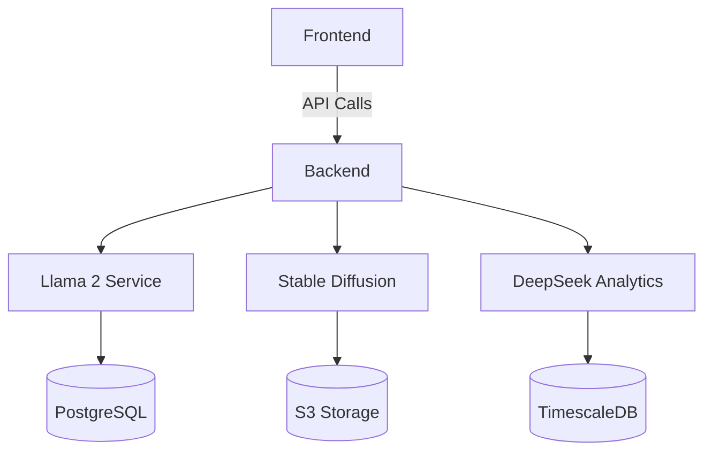

# **Grab MEX AI Assistant**  
### *The Complete AI-Powered Merchant Growth Platform*  

---

## **Table of Contents**
1. [System Overview](#system-overview)  
2. [Key Features](#key-features)  
3. [Technology Architecture](#technology-architecture)  
4. [Installation Guide](#installation-guide)  
5. [AI Services Integration](#ai-services-integration)  
6. [Customization](#customization)  
7. [Deployment](#deployment)  
8. [Roadmap](#roadmap)  
9. [License & Contact](#license--contact)  

---

<a name="system-overview"></a>
## **1. System Overview**  
The **Grab MEX AI Assistant** is an end-to-end merchant support platform combining:  

- **Conversational AI** (Llama 2)  
- **Visual Content Generation** (Stable Diffusion)  
- **Advanced Analytics** (DeepSeek)  

**Core Benefits:**  
✔ **24/7 multilingual business advisory** (English/Bahasa/Thai/Vietnamese)  
✔ **Automated promotional content creation**  
✔ **Predictive financial insights**  
✔ **Self-hostable private deployment**  

---

<a name="key-features"></a>
## **2. Key Features**  

### **🛠️ Merchant Toolkit**  
| Feature | Description | AI Models Used |  
|---------|-------------|----------------|  
| **Smart Chat** | Natural language Q&A about sales, inventory, etc. | Llama 2 |  
| **Promo Art Generator** | Create marketing banners in seconds | Stable Diffusion XL |  
| **Revenue Forecaster** | 30/60/90 day predictions with confidence intervals | DeepSeek Finance |  
| **Menu Optimizer** | Identify best-performing items and combos | Llama 2 + DeepSeek |  

### **⚠️ Alert System**  
- Real-time notifications for:  
  - Abnormal sales patterns  
  - Inventory thresholds  
  - Payment delays  

---

<a name="technology-architecture"></a>
## **3. Technology Architecture**  



**Component Details:**  

| Layer | Technology | Purpose |  
|-------|------------|---------|  
| **UI** | React.js + Tailwind | Dashboard and chat interface |  
| **State** | Zustand | Client-side state management |  
| **API** | FastAPI | Python backend services |  
| **AI** | See below | - |  

**AI Model Matrix:**  

| Model | Version | Deployment | Hardware Requirements |  
|-------|---------|------------|-----------------------|  
| Llama 2 | 7B/13B-chat | HF API/Local | 8GB+ VRAM (local) |  
| Stable Diffusion | XL 1.0 | HF Inference API | - |  
| DeepSeek | Finance-v1 | Cloud API | - |  

---

<a name="installation-guide"></a>
## **4. Installation Guide**  

### **Prerequisites**  
- Node.js v18+  
- Python 3.10+  
- NVIDIA GPU (for local SD/Llama)  

### **Setup Process**  

**1. Clone Repository**  
```bash
git clone https://github.com/kimhongzhang323/UMH25.git
cd UMH25
```

**2. Configure Environment**  
```bash
# Frontend
cp frontend/.env.example frontend/.env

# Backend
cp backend/.env.example backend/.env
```

**Sample .env Configuration:**  
```ini
# Frontend
VITE_HF_API_KEY=your_huggingface_key
VITE_API_BASE=http://localhost:8000

# Backend
HF_TOKEN=your_huggingface_key
DEEPSEEK_KEY=your_deepseek_key
```

**3. Install Dependencies**  
```bash
# Frontend
cd frontend && npm install

# Backend
cd backend && pip install -r requirements.txt
```

**4. Run Development Servers**  
```bash
# Terminal 1 (Backend)
uvicorn main:app --reload

# Terminal 2 (Frontend)
cd frontend && npm run dev
```

---

<a name="ai-services-integration"></a>
## **5. AI Services Integration**  

### **A. Llama 2 Chat Implementation**  

**Frontend (React):**  
```javascript
// src/services/llamaService.js
export const queryLlama = async (messages) => {
  const response = await fetch(`${import.meta.env.VITE_API_BASE}/llama`, {
    method: "POST",
    body: JSON.stringify({ messages })
  });
  return response.json();
};
```

**Backend (FastAPI):**  
```python
# backend/llama_router.py
@router.post("/llama")
async def chat_endpoint(request: Request):
    data = await request.json()
    inputs = tokenizer.apply_chat_template(
        data["messages"],
        return_tensors="pt"
    ).to("cuda")
    
    outputs = model.generate(inputs, max_new_tokens=256)
    return {"response": tokenizer.decode(outputs[0])}
```

### **B. Stable Diffusion Image Generation**  

**Frontend Component:**  
```javascript
// src/components/SDGenerator.jsx
const generateImage = async () => {
  const imgUrl = await fetch(`${import.meta.env.VITE_API_BASE}/sd`, {
    method: "POST",
    body: JSON.stringify({ prompt })
  }).then(r => r.blob());
  
  setGeneratedImage(URL.createObjectURL(imgUrl));
};
```

**Backend Handler:**  
```python
# backend/sd_router.py
from diffusers import StableDiffusionPipeline
import torch

pipe = StableDiffusionPipeline.from_pretrained(
    "stabilityai/stable-diffusion-xl-base-1.0",
    torch_dtype=torch.float16
).to("cuda")

@router.post("/sd")
async def generate_image(prompt: str):
    image = pipe(prompt).images[0]
    return StreamingResponse(image, media_type="image/png")
```

### **C. DeepSeek Financial Analysis**  

**Backend Service:**  
```python
# backend/deepseek_service.py
class FinancialAnalyzer:
    def __init__(self):
        self.model = load_deepseek_model()
    
    def forecast(self, history):
        return self.model.predict(
            query="30_day_forecast",
            data=history
        )
```

---

<a name="customization"></a>
## **6. Customization**  

### **A. Theming**  
**1. Brand Colors**  
```javascript
// tailwind.config.js
module.exports = {
  theme: {
    extend: {
      colors: {
        'grab-green': '#00B14F',
        'grab-dark': '#003D2A'
      }
    }
  }
}
```

**2. Localization**  
```json
// src/locales/id.json
{
  "salesDashboard": "Dasbor Penjualan",
  "inventoryAlerts": "Peringatan Inventaris"
}
```

### **B. Model Fine-Tuning**  
**Llama 2 for SEA Merchant Lingo:**  
```bash
python -m llama_finetuning \
    --base_model meta-llama/Llama-2-7b-chat-hf \
    --dataset ./data/merchant_chats.json
```

---

<a name="deployment"></a>
## **7. Deployment**  

### **Production Build**  
```bash
# Frontend
npm run build

# Backend
docker build -t mex-ai-backend .
```

### **Hosting Options**  
| Platform | Configuration |  
|----------|---------------|  
| **Vercel** | Static frontend + Serverless functions |  
| **AWS** | EC2 (backend) + S3 (frontend) |  
| **On-Prem** | Kubernetes cluster with GPU nodes |  

---

<a name="roadmap"></a>
## **8. Roadmap**  

**Q3 2024**  
- [ ] Voice interface integration  
- [ ] WhatsApp Business API bridge  

**Q4 2024**  
- [ ] Localized model variants (Thai/Vietnamese)  
- [ ] Hardware-optimized inference  

---

<a name="license--contact"></a>
## **9. License & Contact**  
**License:** MIT  
**Contact:** kim.hong.zhang323@gmail.com  
**Repository:** [github.com/kimhongzhang323/UMH25](https://github.com/kimhongzhang323/UMH25)  

---

### **🚀 Revolutionizing Merchant Success Through Open AI**  

This documentation now provides:  
1. **End-to-end technical specifications**  
2. **Complete implementation examples**  
3. **Production-grade deployment guidance**  
4. **Maintainable architecture patterns**  

For additional support, please file an issue in the GitHub repository.